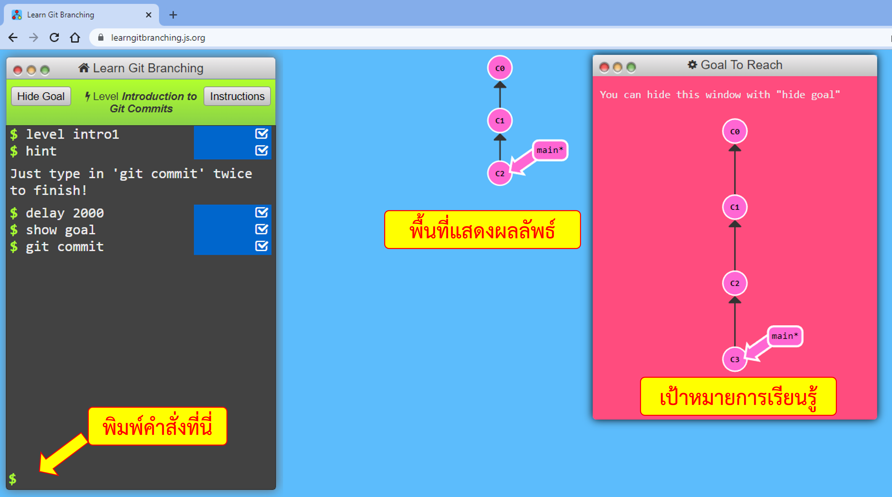
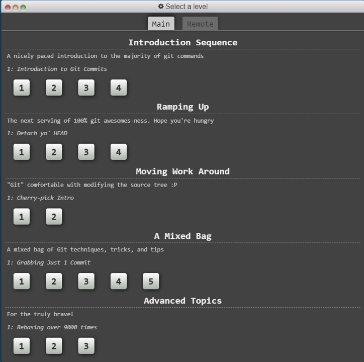
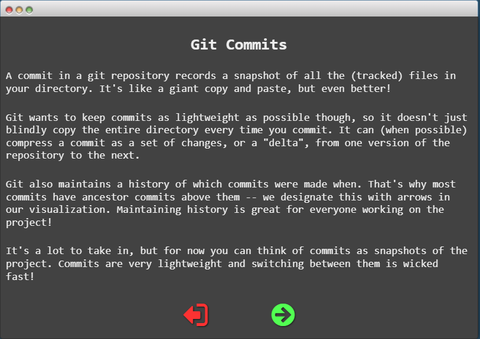
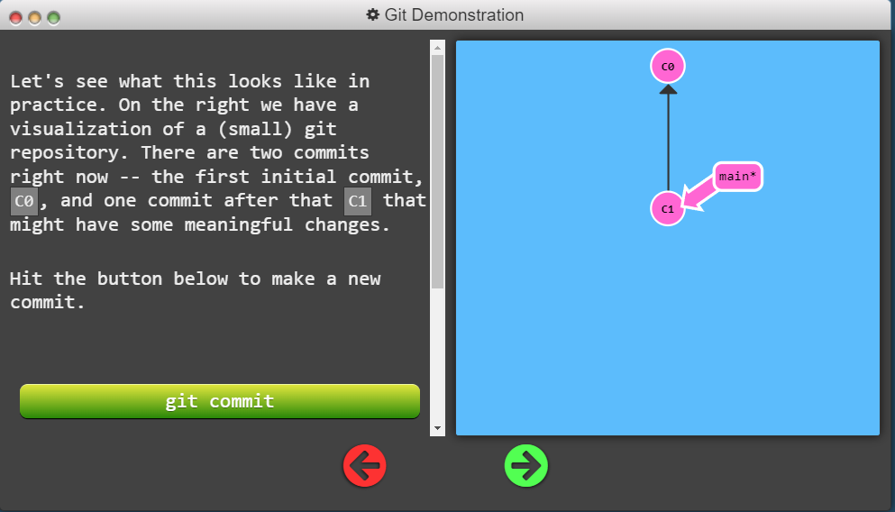
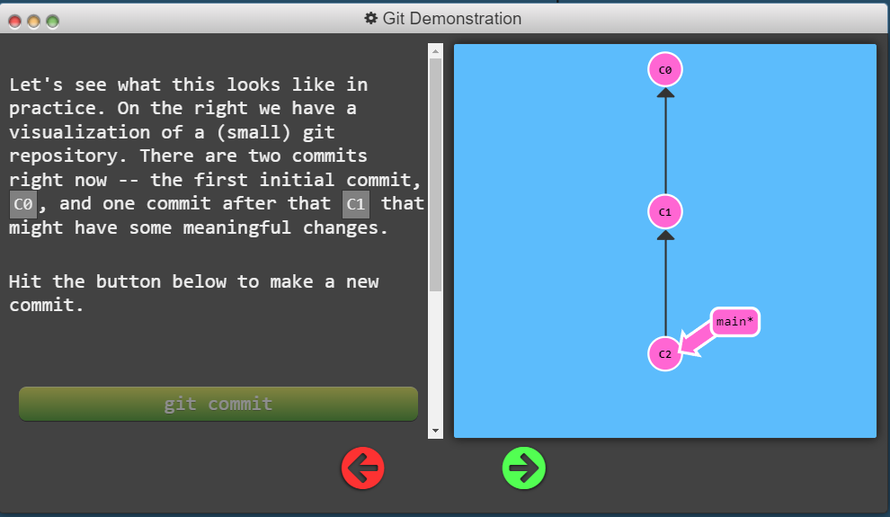
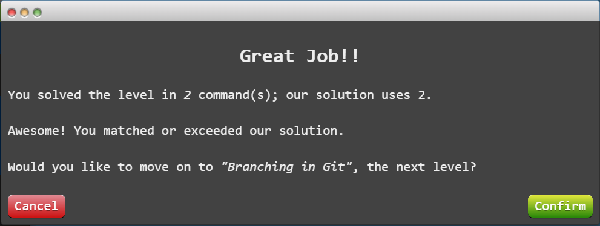
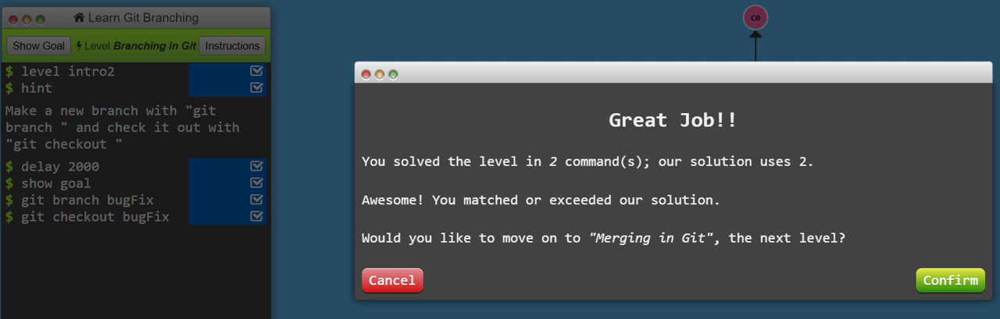

# ใบงานที่ 3 เรียนรู้ git branch

## 1. แนะนำใบงาน

### 1.1 รูปแบบการเรียนรู้

ใบงานนี้จะพานักศึกษามาทำความรู้จักกับ git branch ผ่านการเล่นเกมง่าย ๆ ที่จะทำให้นักศึกษาคุ้นเคยกับคำสั่งของ git มากขึ้น 
เกมนี้สามารถเล่นได้โดยบน website  <https://learngitbranching.js.org/> 
เมื่อผ่านการเล่นแต่ละด่าน จะทำให้นักศึกษามีความรู้และสามารถทำงานกับคำสั่ง branch ได้

 <b>รูปที่ 1</b> รูปแบบหน้าจอในการเล่นเกม

เมื่อเข้าสู่เกม หน้าจอจะถูกแบ่งออกเป็นสามส่วนคือ

1. พื้นที่พิมพ์คำสั่ง
2. พื้นที่แสดงผลลัพธ์ของการทำคำสั่ง
3. พื้นที่แสดงเป้าหมายการเรียนรู้

นักศึกษาสามารถลองพิมพ์คำสั่งต่าง ๆ  ได้ (แต่ในเกมจะไม่รองรับคำสั่งที่ซับซ้อนของ git
ในเวบนี้จะ focus ไปที่คำสั่งที่ใช้เพื่อเล่นเกมให้สำเร็จ)

#### source code ของเวบเกม

ถ้าต้องการดู source code ของเวบเกมนี้ สามารถดูได้ที่ <https://github.com/pcottle/learnGitBranching>

## 2. เกมที่ต้องเล่นให้สำเร็จ

เกมที่ต้องเล่นให้สำเร็จ มีทั้งหมด 5 ระดับ
เริ่มตั้งแต่การแนะนำการใช้คำสั่งพื้นฐานและแนะนำการเล่นเกม ไปจนถึงขั้นสูง ประกอบด้วย

1. Intruduction Sequence
2. Ramping Up
3. Moving Work Around
4. A Mixed Bug
5. Advanced Topics

 <b>รูปที่ 2</b>  Level ต่าง ๆ ในเกม

## 3. ตัวอย่างการเล่นเกม

ในการเล่นเกม จะมีการแสดงคำแนะนำในขั้นค่างๆ ให้นักศึกษาอ่านและทำความเข้าใจคำสั่งก่อนลงมือปฏิบัติ

 <b>รูปที่ 3</b> คำแนะนำก่อนการเล่นแต่ละเกม 

จะมี giude นำทางเพื่อแสดงตัวอย่างให้ให้สามารถดำเนินการเล่นจนบรรลุเป้าหมายได้

 <b>รูปที่ 4 (a)</b> ตัวอย่างเกมที่ 1 

ในที่นี้ ต้องการให้สร้าง commit ขึ้นมา 2 จุด ซึ่งเมื่อทำครบแล้ว เกมจะแสดงผลสัมฤทธิ์

 <b>รูปที่ 4 (b)</b> ตัวอย่างเกมที่ 1 

 <b>รูปที่ 5</b> ผลการเล่นเกม 

## 4. การทำงานและการส่งงาน

4.1 ให้นักศึกษาเล่นเกมให้ครบทุกด่าน  
4.2 แต่ละด่าน ให้ capture หน้าจอให้เห็นทั้งคำสั่งและผลลัพธ์ (ตัวอย่างในรูปที่ 6)

 <b>รูปที่ 6</b> ตัวอย่างการ capture หน้าจอเพื่อส่งงาน 

4.3 สร้าง folder ตามรหัสนักศึกษา  
4.4 และสร้างไฟล์ Level1.md จนถึง Level5.md เพื่อเก็บผลการเล่น  
4.5 ในไฟล์ Levelx.md ให้ใส่รูปผลการเล่นของทุกเกม โดยในรูป   ให้ใส่ชื่อและรหัสนักศึกษาด้วย 

capture ด้วย powerpoint แล้วแทรกลายน้ำ (ชื่อ+รห้ส จากนั้นเลือกทั้งหมดแล้วบันทึกเป็นรูปภาพ) ดูตัวอย่างได้ที่  <https://youtu.be/LRNYjmXpJG0>

4.6 เมื่อเล่นครบ ส่งงานโดยการ pull request มาที่ <https://github.com/COM-LAB-I-2565/COM-LAB-I-LabSheet-3>

---

